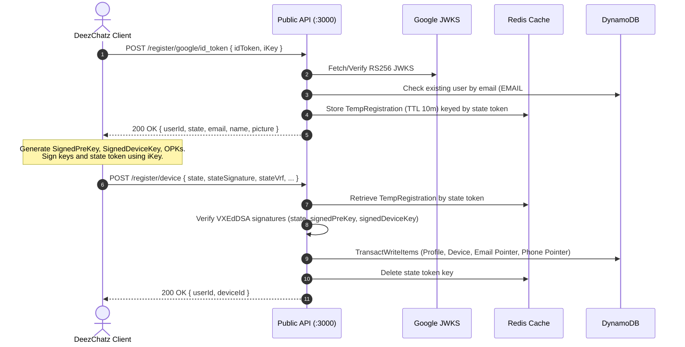

# API Reference

The DeezChatz API is split into two distinct logical services running on separate ports.

- **Public API (Port 3000)**: Client-facing — Google OAuth verification, device key registration, X3DH key bundle discovery, profile synchronization, and authenticated FCM device token updates.
- **Private API (Port 3001)**: Internal only — **never exposed to the internet**. Receives broker webhooks (e.g., RMQTT offline message events), triggers data-only wake-up push notifications, and persists offline message queues.

---

## Authentication

### Open Endpoints (Public API)

Endpoints required to onboard new users or devices do not require request signature headers:

1. `POST /register/google/id_token` — Validated against Google's JWKS (RS256, audience matching `GOOGLE_CLIENT_ID`, verified email claim).
2. `POST /register/device` — Validated via cryptographic proof-of-possession (VXEdDSA signatures and VRFs over the `state` token, `signedPreKey`, and `signedDeviceKey` using the client's `iKey`).

### Authenticated Endpoints (Public API)

All endpoints operating on existing user data or performing key discovery require **Stateless Signature Authentication** via Axum's `AuthenticatedUser` middleware extractor.

#### Required Request Headers

| Header | Format | Description |
| :--- | :--- | :--- |
| `X-User-Id` | UUID v4 | The caller's unique User ID. Must be a valid UUID v4 format. |
| `X-Timestamp` | Milliseconds (UTC) | Current UNIX epoch timestamp in milliseconds (as a numeric string). |
| `X-Signature` | Base64 (96 bytes decoded) | VXEdDSA signature of the payload string `userId + timestamp` signed using the user's `signedPreKey`. |
| `X-Vrf` | Base64 (32 bytes decoded) | Verifiable Random Function (VRF) output corresponding to the signature. |

#### Authentication Rules & Security

- **Strict UUID v4 Validation**: The `X-User-Id` header and any user ID path parameters must strictly match the UUID v4 specification. Malformed or non-v4 UUIDs are immediately rejected with `401 Unauthorized` or `400 Bad Request`.
- **Timestamp Drift Window**: The `X-Timestamp` must be within **±10 seconds** (10,000 ms) of the server's current UTC time. Requests outside this window fail with `401 Unauthorized: Timestamp expired or too far in the future`.
- **Key Binding**: The server queries the caller's registered `signedPreKey` from DynamoDB (`USER#<userId>`) and verifies the signature over `format!("{}{}", userId, timestamp)`.
- **Replay Protection**: Every valid signature is atomically stored in Redis under the key `replay:sig:<X-Signature>` with a **20-second TTL** (`SET NX EX 20`). Because 20 seconds exceeds the ±10s timestamp drift window, any replayed request with an identical signature is rejected with `401 Unauthorized: Replay attack detected`.

---

## Error Response Format

All error responses return standard HTTP status codes and a consistent JSON payload structure:

```json
{
  "error": "Detailed error description"
}
```

### Common HTTP Status Codes

| Status Code | Reason |
| :--- | :--- |
| `200 OK` | The request succeeded. |
| `400 Bad Request` | Missing or invalid parameters, malformed UUID format, or invalid Base64/cryptographic key lengths. |
| `401 Unauthorized` | Invalid Google ID token, signature verification failure, VRF mismatch, expired timestamp drift, or replay attack. |
| `404 Not Found` | Pending registration session expired in Redis, target user not found, or device not registered. |
| `409 Conflict` | Concurrency conflict while popping One-Time Pre-Keys (OPKs), or transaction condition check failure (e.g., phone pointer uniqueness). |
| `500 Internal Server Error` | Database operation failure or internal invariant error (infrastructure details are sanitized). |
| `502 Bad Gateway` | Upstream network failure fetching or parsing Google JWKS certificates. |

---

## 1. Registration Flow

Registration is a two-phase cryptographic handshake. Phase 1 verifies Google OAuth identity, and Phase 2 uploads and binds the user's cryptographic keys.



---

### Verify Google ID Token

Verifies a Google OAuth ID token (JWT) and initiates a registration session. If a profile with the Google account's verified email already exists, its existing `userId` is retained (enabling re-registration). Otherwise, a new `userId` (UUID v4) is generated.

- **Endpoint**: `POST /register/google/id_token`
- **Authentication**: None (Open)
- **Request Headers**: `Content-Type: application/json`
- **Request Body**:
  ```json
  {
    "idToken": "eyJhbGciOiJSUzI1NiIsImtpZCI6Ij...",
    "iKey": "BR3..."
  }
  ```
  | Field | Type | Required | Description |
  | :--- | :--- | :--- | :--- |
  | `idToken` | `string` | Yes | Google OAuth ID Token (JWT). Must be signed by Google, have a verified email, and match `GOOGLE_CLIENT_ID`. |
  | `iKey` | `string` | Yes | Base64-encoded Curve25519 public Identity Key (33 bytes decoded). |

- **Example Request**:
  ```bash
  curl -X POST http://localhost:3000/register/google/id_token \
       -H "Content-Type: application/json" \
       -d '{
         "idToken": "eyJhbGciOiJSUzI1NiIs...",
         "iKey": "BR3w8K5X5y7..."
       }'
  ```

- **Responses**:
  - `200 OK`:
    ```json
    {
      "status": "success",
      "userId": "3fa85f64-5717-4562-b3fc-2c963f66afa6",
      "state": "8b9415c1-9257-41ec-bbf6-6b22c2a05cf6",
      "email": "user@gmail.com",
      "name": "User Name",
      "picture": "https://lh3.googleusercontent.com/..."
    }
    ```
    *(The `state` token is a UUID v4 session identifier valid for 10 minutes in Redis under `reg:pending:<state>`).*
  - `400 Bad Request`: Missing ID token, malformed JWT headers, missing `kid`, or invalid JWK.
  - `401 Unauthorized`: Invalid/expired ID token, unverified Google email, or incorrect client audience.
  - `502 Bad Gateway`: Failed to fetch or parse Google's public JWKS certificates.
  - `500 Internal Server Error`: State serialization failure or Redis storage error.

---

### Register Device & Cryptographic Keys

Finalizes registration (or re-registration) by verifying proof-of-possession of the Identity Key and saving public keys to DynamoDB.

- **Endpoint**: `POST /register/device`
- **Authentication**: None (Validated cryptographically via signatures in payload)
- **Request Headers**: `Content-Type: application/json`
- **Request Body**:
  ```json
  {
    "state": "8b9415c1-9257-41ec-bbf6-6b22c2a05cf6",
    "stateSignature": "Base64 (96 bytes)",
    "stateVrf": "Base64 (32 bytes)",
    "phone": "+1234567890",
    "signedPreKey": "Base64 (33 bytes)",
    "preKeySign": "Base64 (96 bytes)",
    "preKeyVrf": "Base64 (32 bytes)",
    "opks": [
      "Base64 (33 bytes)",
      "Base64 (33 bytes)"
    ],
    "signedDeviceKey": "Base64 (33 bytes)",
    "devKeySign": "Base64 (96 bytes)",
    "devKeyVrf": "Base64 (32 bytes)",
    "fcmToken": "string (optional)"
  }
  ```
  | Field | Type | Required | Description |
  | :--- | :--- | :--- | :--- |
  | `state` | `string` | Yes | UUID v4 session token returned from `POST /register/google/id_token`. |
  | `stateSignature` | `string` | Yes | Base64 VXEdDSA signature of the `state` string using the client's `iKey`. |
  | `stateVrf` | `string` | Yes | Base64 VRF output verifying the `stateSignature`. |
  | `phone` | `string` | Yes | User's phone number in E.164 or normalized format. |
  | `signedPreKey` | `string` | Yes | Base64 Curve25519 Signed Pre-Key (33 bytes decoded). |
  | `preKeySign` | `string` | Yes | Base64 VXEdDSA signature of `signedPreKey` using `iKey`. |
  | `preKeyVrf` | `string` | Yes | Base64 VRF output for `preKeySign`. |
  | `opks` | `array<string>` | No | List of Base64 Curve25519 One-Time Pre-Keys (33 bytes each). Defaults to empty list `[]`. |
  | `signedDeviceKey` | `string` | Yes | Base64 Curve25519 Signed Device Key (33 bytes decoded). |
  | `devKeySign` | `string` | Yes | Base64 VXEdDSA signature of `signedDeviceKey` using `iKey`. |
  | `devKeyVrf` | `string` | Yes | Base64 VRF output for `devKeySign`. |
  | `fcmToken` | `string` | No | Firebase Cloud Messaging device token for push notifications. |

- **Example Request**:
  ```bash
  curl -X POST http://localhost:3000/register/device \
       -H "Content-Type: application/json" \
       -d '{
         "state": "8b9415c1-9257-41ec-bbf6-6b22c2a05cf6",
         "stateSignature": "c2lnbmF0dXJl...",
         "stateVrf": "dnJmb3V0cHV0...",
         "phone": "+1234567890",
         "signedPreKey": "QlIzdzhLNVg1...",
         "preKeySign": "cHJlS2V5U2ln...",
         "preKeyVrf": "cHJlS2V5VnJm...",
         "opks": ["b3BrMQ...", "b3BrMg..."],
         "signedDeviceKey": "ZGV2S2V5...",
         "devKeySign": "ZGV2S2V5U2ln...",
         "devKeyVrf": "ZGV2S2V5VnJm...",
         "fcmToken": "fcm-device-token-string"
       }'
  ```

- **Responses**:
  - `200 OK`:
    ```json
    {
      "status": "success",
      "userId": "3fa85f64-5717-4562-b3fc-2c963f66afa6",
      "deviceId": "c8a1e8a9-4091-4cf1-8c43-d34e9e03fba8"
    }
    ```
  - `400 Bad Request`: Missing phone number, `state` is not a valid UUID v4, or invalid Base64 key/signature encoding/length.
  - `401 Unauthorized`: VXEdDSA signature verification failure or VRF mismatch for `state`, `signedPreKey`, or `signedDeviceKey`.
  - `404 Not Found`: Pending registration state expired or not found in Redis.
  - `409 Conflict`: Conflict on DynamoDB transactional write (e.g. phone pointer uniqueness constraint check failed).
  - `500 Internal Server Error`: DynamoDB write failure.

---

## 2. Key Discovery & Sync

---

### Get Pre-Key Bundle

Retrieves the cryptographic material required by a client to initiate an end-to-end encrypted session with a recipient via X3DH. Atomically pops one One-Time Pre-Key (OPK) from the recipient's pool.

- **Endpoint**: `POST /bundle/{identifier}`
- **Path Parameter**:
  - `identifier` (`string`, required): Can be the recipient's **Email** (`user@example.com`), **Phone** (`+1234567890`), or **User ID** (UUID v4).
- **Authentication**: Stateless Signature Authentication (`X-User-Id`, `X-Timestamp`, `X-Signature`, `X-Vrf`).
- **Concurrency & Retry**: If concurrent requests attempt to pop the same OPK, the server applies an automatic exponential back-off retry loop (up to 5 retries with 50ms, 100ms, 200ms, 400ms back-off).

- **Example Request**:
  ```bash
  curl -X POST http://localhost:3000/bundle/bob@example.com \
       -H "X-User-Id: 3fa85f64-5717-4562-b3fc-2c963f66afa6" \
       -H "X-Timestamp: 1700000000000" \
       -H "X-Signature: c2lnbmF0dXJl..." \
       -H "X-Vrf: dnJmb3V0cHV0..."
  ```

- **Responses**:
  - `200 OK`:
    ```json
    {
      "userId": "7b8f9e0a-1234-4567-89ab-cdef01234567",
      "deviceId": "c8a1e8a9-4091-4cf1-8c43-d34e9e03fba8",
      "identityKey": "BR3w8K5X5y7...",
      "signedPreKey": "QlIzdzhLNVg1...",
      "signature": "cHJlS2V5U2ln...",
      "phone": "+1234567890",
      "picture": "https://lh3.googleusercontent.com/...",
      "opk": {
        "id": 14,
        "key": "b3BrMTQ..."
      }
    }
    ```
    *(Note: `opk` is omitted if the recipient has no OPKs remaining. `phone` and `picture` are optional).*
  - `400 Bad Request`: Missing identifier or invalid identifier format (not an email, phone number, or valid UUID v4).
  - `401 Unauthorized`: Missing auth headers, invalid timestamp drift (>10s), signature verification failure, VRF mismatch, or replay attack.
  - `404 Not Found`: Target user profile not found.
  - `409 Conflict`: OPK pop conflict persisted across all retry attempts.
  - `500 Internal Server Error`: DynamoDB read or update failure.

---

### Get Sync Bundle

Retrieves read-only profile data and identity keys for a contact without consuming a One-Time Pre-Key. Used for contact list synchronization and key verification.

- **Endpoint**: `GET /bundle/sync/{userId}`
- **Path Parameter**:
  - `userId` (`string`, required): The target user's UUID v4 string.
- **Authentication**: Stateless Signature Authentication (`X-User-Id`, `X-Timestamp`, `X-Signature`, `X-Vrf`).

- **Example Request**:
  ```bash
  curl -X GET http://localhost:3000/bundle/sync/7b8f9e0a-1234-4567-89ab-cdef01234567 \
       -H "X-User-Id: 3fa85f64-5717-4562-b3fc-2c963f66afa6" \
       -H "X-Timestamp: 1700000000000" \
       -H "X-Signature: c2lnbmF0dXJl..." \
       -H "X-Vrf: dnJmb3V0cHV0..."
  ```

- **Responses**:
  - `200 OK`:
    ```json
    {
      "userId": "7b8f9e0a-1234-4567-89ab-cdef01234567",
      "identityKey": "BR3w8K5X5y7...",
      "picture": "https://lh3.googleusercontent.com/...",
      "displayName": "Bob Smith"
    }
    ```
  - `400 Bad Request`: Missing `userId` or invalid UUID v4 format.
  - `401 Unauthorized`: Missing or invalid signature headers, timestamp drift, or replay attack.
  - `404 Not Found`: Target user profile not found.
  - `500 Internal Server Error`: Database error or missing identity key on profile.

---

## 3. Device Management

---

### Update FCM Token

Updates the Firebase Cloud Messaging push token associated with a registered device.

- **Endpoint**: `POST /register/device/fcm`
- **Authentication**: Stateless Signature Authentication (`X-User-Id`, `X-Timestamp`, `X-Signature`, `X-Vrf`).
- **Request Headers**: `Content-Type: application/json`
- **Request Body**:
  ```json
  {
    "deviceId": "c8a1e8a9-4091-4cf1-8c43-d34e9e03fba8",
    "fcmToken": "fcm_registration_token_string"
  }
  ```
  | Field | Type | Required | Description |
  | :--- | :--- | :--- | :--- |
  | `deviceId` | `string` | Yes | Target device's UUID v4 identifier. |
  | `fcmToken` | `string` | Yes | New FCM push token issued by Firebase. |

- **Example Request**:
  ```bash
  curl -X POST http://localhost:3000/register/device/fcm \
       -H "X-User-Id: 3fa85f64-5717-4562-b3fc-2c963f66afa6" \
       -H "X-Timestamp: 1700000000000" \
       -H "X-Signature: c2lnbmF0dXJl..." \
       -H "X-Vrf: dnJmb3V0cHV0..." \
       -H "Content-Type: application/json" \
       -d '{
         "deviceId": "c8a1e8a9-4091-4cf1-8c43-d34e9e03fba8",
         "fcmToken": "eK3_f8K...new-fcm-token"
       }'
  ```

- **Responses**:
  - `200 OK`:
    ```json
    {
      "status": "success",
      "message": "FCM token updated"
    }
    ```
  - `400 Bad Request`: `deviceId` is not a valid UUID.
  - `401 Unauthorized`: Invalid signature, timestamp drift (>10s), or signature replay attack.
  - `404 Not Found`: Device not found or not registered under caller in DynamoDB.
  - `500 Internal Server Error`: DynamoDB update failure.

---

## 4. User Management

---

### Delete Account

Permanently deletes the caller's account, removing their user profile, registered devices, phone and email pointer lookups, and temporary registration records.

- **Endpoint**: `DELETE /users/me`
- **Authentication**: Stateless Signature Authentication (`X-User-Id`, `X-Timestamp`, `X-Signature`, `X-Vrf`).

- **Example Request**:
  ```bash
  curl -X DELETE http://localhost:3000/users/me \
       -H "X-User-Id: 3fa85f64-5717-4562-b3fc-2c963f66afa6" \
       -H "X-Timestamp: 1700000000000" \
       -H "X-Signature: c2lnbmF0dXJl..." \
       -H "X-Vrf: dnJmb3V0cHV0..."
  ```

- **Responses**:
  - `200 OK`:
    ```json
    {
      "status": "success",
      "message": "Account deleted"
    }
    ```
  - `401 Unauthorized`: Invalid signature, timestamp drift (>10s), or signature replay attack.
  - `500 Internal Server Error`: DynamoDB transaction or deletion failure.

---

### Delete Account via OAuth (Web)

Deletes a user account securely from a web browser using OAuth 2.0 PKCE, without requiring the device's cryptographic identity key or signatures. This is the only endpoint that allows account deletion without a valid signature.

- **Endpoint**: `DELETE /users/me/oauth`
- **Authentication**: None (Relies on OAuth Code Exchange)
- **Request Headers**: `Content-Type: application/json`
- **Request Body**:
  ```json
  {
    "code": "4/0AeaYSH...",
    "codeVerifier": "some_random_pkce_verifier_string",
    "redirectUri": "https://deezchatz.com/delete-account"
  }
  ```

- **Example Request**:
  ```bash
  curl -X DELETE http://localhost:3000/users/me/oauth \
       -H "Content-Type: application/json" \
       -d '{
         "code": "4/0AeaYSH...",
         "codeVerifier": "some_random_pkce_verifier_string",
         "redirectUri": "https://deezchatz.com/delete-account"
       }'
  ```

- **Responses**:
  - `200 OK`:
    ```json
    {
      "status": "success",
      "message": "Account deleted"
    }
    ```
  - `401 Unauthorized`: Invalid or expired authorization code, or Google email not verified.
  - `404 Not Found`: Account not found for the provided Google email (the email doesn't correspond to any registered user).
  - `500 Internal Server Error`: DynamoDB transaction or deletion failure.

---

### Report User

Submits an abuse, harassment, or spam report against another user, optionally including message transcripts for moderation.

- **Endpoint**: `POST /users/report`
- **Authentication**: Stateless Signature Authentication (`X-User-Id`, `X-Timestamp`, `X-Signature`, `X-Vrf`).
- **Request Headers**: `Content-Type: application/json`
- **Request Body**:
  ```json
  {
    "reportedUserId": "7b8f9e0a-1234-4567-89ab-cdef01234567",
    "reason": "Harassment / Spam / Abuse",
    "messages": [
      {
        "id": "msg_01HZX87",
        "content": "Abusive text message content",
        "sender_id": "7b8f9e0a-1234-4567-89ab-cdef01234567",
        "created_at": 1756548239000
      }
    ]
  }
  ```
  | Field | Type | Required | Description |
  | :--- | :--- | :--- | :--- |
  | `reportedUserId` | `string` | Yes | UUID v4 of the user being reported. Cannot be the caller's own ID. |
  | `reason` | `string` | Yes | Non-empty description or category of the abuse. |
  | `messages` | `array` | No | Optional array of reported message objects for moderation. |

- **Example Request**:
  ```bash
  curl -X POST http://localhost:3000/users/report \
       -H "X-User-Id: 3fa85f64-5717-4562-b3fc-2c963f66afa6" \
       -H "X-Timestamp: 1700000000000" \
       -H "X-Signature: c2lnbmF0dXJl..." \
       -H "X-Vrf: dnJmb3V0cHV0..." \
       -H "Content-Type: application/json" \
       -d '{
         "reportedUserId": "7b8f9e0a-1234-4567-89ab-cdef01234567",
         "reason": "Harassment / Spam",
         "messages": []
       }'
  ```

- **Responses**:
  - `200 OK`:
    ```json
    {
      "status": "success",
      "reportId": "rep_c8a1e8a9-4091-4cf1-8c43-d34e9e03fba8"
    }
    ```
  - `400 Bad Request`: Invalid `reportedUserId` UUID v4 format, attempting to report oneself, or empty `reason`.
  - `401 Unauthorized`: Invalid signature, timestamp drift (>10s), or signature replay attack.
  - `500 Internal Server Error`: DynamoDB write failure.

---

## 5. Private API (Port 3001)

> **⚠️ Security Notice**: Port 3001 is for **internal backend communication only** (between the RMQTT broker and this API). It must be firewalled and never exposed to the public internet.

---

### MQTT Offline Message Webhook

Invoked by the RMQTT broker (`rmqtt-web-hook` plugin) when a message is published to an offline recipient.

- **Endpoint**: `POST /offline_message`
- **Caller**: RMQTT Broker
- **Authentication**: None (Protected via network isolation)
- **Topic Convention**:
  ```
  /deezchatz/{recipient_id}/{recipient_device_id}/{sender_id}/{sender_device_id}
  ```

#### Webhook Behavior

1. Parses recipient and sender identifiers from the topic regex.
2. Resolves the recipient device's push token from DynamoDB (`USER#<recipient_id>`, `DEVICE#<recipient_device_id>`).
3. Dispatches a **data-only wake-up push notification** via Firebase Cloud Messaging (FCM). For zero-trust confidentiality, message ciphertext is **never** forwarded in the push payload:
   ```json
   {
     "sender_id": "<sender_id>",
     "sender_device_id": "<sender_device_id>",
     "topic": "<topic>"
   }
   ```
4. If FCM returns `PushError::TokenInvalid` (e.g., app uninstalled or token expired), automatically cleans up the stale `fcmToken` from DynamoDB.
5. Persists the message record in DynamoDB with a 7-day auto-expiring TTL:
   - **pk**: `USER#<recipient_id>`
   - **sk**: `OFFLINE_MSG#<timestamp_ms>#<uuid>`
   - **ttl**: Unix epoch timestamp (current time + 7 days)

#### Request Payload Example (from RMQTT)

```json
{
  "action": "offline_message",
  "from_node": 1,
  "from_ipaddress": "127.0.0.1",
  "from_clientid": "sender-client-id",
  "from_username": "sender-user-id",
  "node": 1,
  "ipaddress": "127.0.0.1",
  "clientid": "recipient-client-id",
  "username": "recipient-user-id",
  "dup": false,
  "retain": false,
  "qos": 1,
  "topic": "/deezchatz/7b8f9e0a-1234-4567-89ab-cdef01234567/c8a1e8a9-4091-4cf1-8c43-d34e9e03fba8/3fa85f64-5717-4562-b3fc-2c963f66afa6/a1b2c3d4-0000-1111-2222-333344445555",
  "packet_id": 1024,
  "payload": "T2ZmbGluZSBFbmNyeXB0ZWQgQ2lwaGVydGV4dCBCbG9i...",
  "pts": 1700000000000,
  "ts": 1700000000000,
  "time": "2026-08-30 05:45:00.000"
}
```

- **Responses**:
  - `200 OK`: Webhook acknowledged (returned for both processed offline messages and other RMQTT session events).
  - `400 Bad Request`: Malformed JSON or invalid topic schema.
  - `500 Internal Server Error`: DynamoDB offline message persistence failure.
