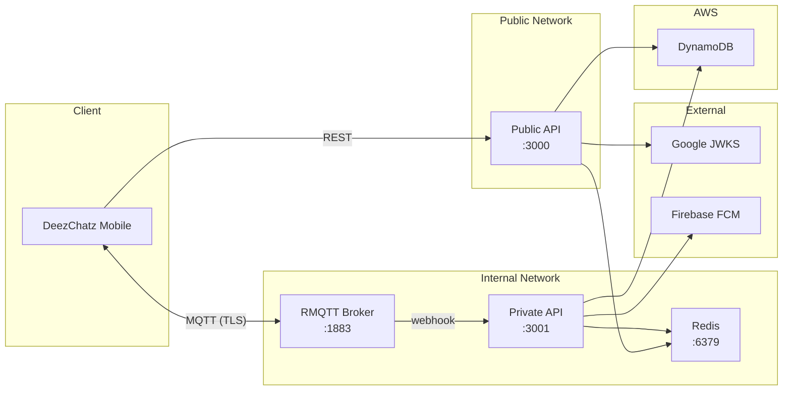
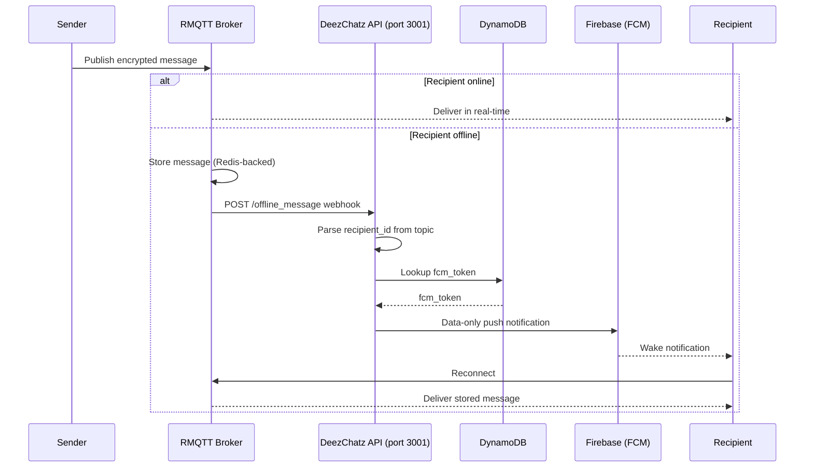

# Architecture Guide

This document covers the **system architecture** of the DeezChatz API — the database design, infrastructure layout, MQTT messaging layer, and how the components connect.

For the security model and conceptual overview, see [Concepts](concepts.md).
For the detailed cryptographic verification flows, see [Cryptographic Flows](cryptographic_flows.md).

---

## System Overview

The DeezChatz API runs two HTTP servers concurrently on separate ports:

| Port | Name | Purpose | Authentication |
|------|------|---------|----------------|
| **3000** | Public API | Client-facing — registration, key discovery, device management | VXEdDSA signature auth (for authenticated endpoints) |
| **3001** | Private API | Internal only — receives MQTT broker webhooks | **None** — must be network-isolated from the internet |

> **⚠️ Port 3001 must never be exposed to the internet.** It has no authentication. Only trusted backend services (the RMQTT broker) should reach it.



---

## Infrastructure (Docker Compose)

Local development uses Docker Compose to run supporting services:

```yaml
services:
  redis:            # Cache — pending registrations, replay protection
    image: redis:latest
    ports: ["6379:6379"]

  rmqtt:            # MQTT broker — real-time message delivery
    image: rmqtt/rmqtt:latest
    ports: ["1883:1883"]
    volumes:        # Config files in devenv/rmqtt/
      - ./devenv/rmqtt/rmqtt.toml
      - ./devenv/rmqtt/plugins/rmqtt-web-hook.toml     # Offline message webhook config
      - ./devenv/rmqtt/plugins/rmqtt-message-storage.toml
      - ./devenv/rmqtt/plugins/rmqtt-session-storage.toml
```

The API itself runs directly via `cargo run` during development (not in Docker).

### RMQTT Configuration

The RMQTT broker is configured via files in `devenv/rmqtt/`:
- `rmqtt.toml` — Main broker configuration.
- `rmqtt-web-hook.toml` — Webhook plugin that POSTs to `http://host.docker.internal:3001/offline_message` when a subscriber is offline.
- `rmqtt-message-storage.toml` — Redis-backed message storage for offline messages.
- `rmqtt-session-storage.toml` — Redis-backed session persistence.

---

## Environment Variables

| Variable | Required | Default | Description |
|----------|----------|---------|-------------|
| `AWS_REGION` | ✅ | — | AWS region for DynamoDB (e.g., `ap-south-1`) |
| `REDIS_URL` | ✅ | — | Redis connection URL (e.g., `redis://localhost:6379`) |
| `PRIMARY_TABLE` | ✅ | — | DynamoDB table name (e.g., `deezchatz-identity`) |
| `GOOGLE_CLIENT_ID` | ✅ | — | Google OAuth Web Client ID (for verifying `idToken` JWTs) |
| `GOOGLE_CLIENT_SECRET` | ✅ | — | Google OAuth client secret |
| `GOOGLE_REDIRECT_URI` | ✅ | — | Google OAuth redirect URI |
| `PUBLIC_API_PORT` | ❌ | `3000` | Port for the public API |
| `PRIVATE_API_PORT` | ❌ | `3001` | Port for the private API |

---

## Data Model (DynamoDB Single-Table Design)

All entities are stored in a single DynamoDB table using Partition Key (`pk`) and Sort Key (`sk`) to model relationships without Global Secondary Indexes (GSIs).

### Primary Table (`deezchatz-identity`)

| Entity | `pk` | `sk` | Key Fields |
|--------|------|------|------------|
| **Profile** | `USER#{userId}` | `PROFILE` | `name`, `email`, `picture`, `iKey`, `signedPreKey`, `signature`, `opks`, `deviceId`, `signedDeviceKey`, `fcmToken`, `phone`, `createdAt`, `updatedAt` |
| **Device** | `USER#{userId}` | `DEVICE#{deviceId}` | `signedDeviceKey`, `fcmToken`, `createdAt`, `updatedAt` |
| **Email Pointer** | `EMAIL#{email}` | `PTR` | `userId` |
| **Phone Pointer** | `PHONE#{phone}` | `PTR` | `userId` |
| **User Report** | `REPORTER#{reporterId}` | `REPORTED#{reportedId}#{timestamp}` | `reporterId`, `reportedId`, `reason`, `messages`, `createdAt` |
| **Offline Message** | `OFFLINE#{recipientId}` | `{senderId}#{timestamp}` | `senderId`, `senderDeviceId`, `topic`, `payload`, `createdAt`, `ttl` |

### Base Table Lookups (Zero-GSI)

| Lookup by | `pk` | `sk` | Returns |
|-----------|------|------|---------|
| **Email** | `EMAIL#{email}` | `PTR` | `userId` (followed by direct `USER#{userId}` profile fetch) |
| **Phone** | `PHONE#{phone}` | `PTR` | `userId` (followed by direct `USER#{userId}` profile fetch) |

This allows finding a user's `userId` and profile by their email or phone number using direct primary key `GetItem` lookups with strong consistency and zero GSI cost.

### Redis (Temporary State)

| Key Pattern | TTL | Purpose |
|------------|-----|---------|
| `reg:pending:{state_token}` | 10 min | Stores Google OAuth claims and `iKey` during registration handoff (Phase 1 → Phase 2) |
| `replay:sig:{signature_b64}` | 20 sec | Prevents signature replay attacks across all authenticated endpoints |

---

## MQTT Messaging Layer

All real-time messaging is handled by the RMQTT broker. The API server never sees plaintext — it only handles delivery bookkeeping.

### Topic Schema

```
/deezchatz/{recipient_id}/{recipient_device_id}/{sender_id}/{sender_device_id}
```

All four IDs are embedded in the topic, making routing self-describing. No server-side lookup is needed to determine delivery intent.

### Subscription Patterns

| Pattern | Purpose |
|---------|---------|
| `/deezchatz/{recipient_id}/#` | Receive messages across all devices (multi-device sync) |
| `/deezchatz/{recipient_id}/{recipient_device_id}/#` | Receive messages for a specific device only |

### Offline Delivery Flow

When a message arrives for an offline subscriber:



**Key detail**: The push notification is **data-only** — it contains no message content. It simply wakes the client, which then reconnects via MQTT to retrieve the stored message from the broker.

---

## Application State

The `AppState` struct is initialized once at startup and shared across all Axum handlers via `State<AppState>`:

```rust
pub struct AppState {
    pub dynamo: DynamoClient,           // DynamoDB client
    pub redis: ConnectionManager,        // Redis connection pool
    pub http_client: reqwest::Client,    // Shared HTTP client (Google JWKS, FCM)
    pub push_provider: Arc<dyn PushProvider>,  // FCM (now), APNs (future)
    pub primary_table: String,
    pub google_client_id: String,
    pub google_client_secret: String,
    pub google_redirect_uri: String,
    pub google_jwks: Arc<RwLock<(u64, Option<JwkSet>)>>,  // Cached JWKS with TTL
}
```

The `http_client` is reused for all outbound HTTP requests (Google JWKS fetching, FCM push) to avoid per-request TLS handshakes.

The `push_provider` uses a trait (`PushProvider`) so the push notification backend can be swapped (FCM → APNs) without changing handler code.
